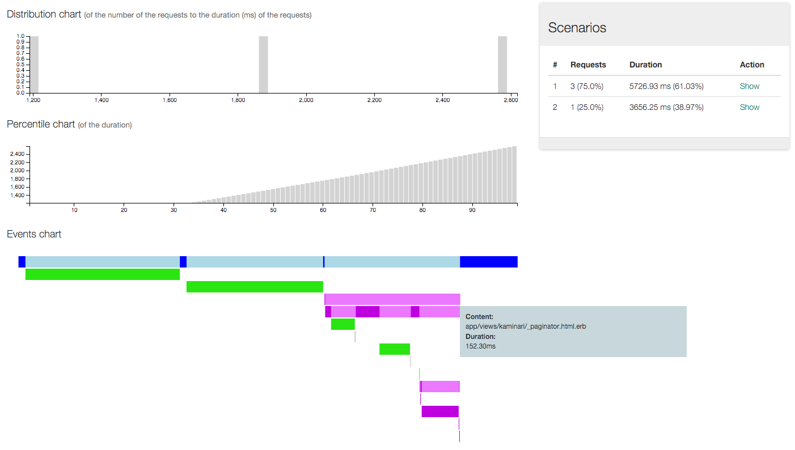

# lenshq server

[](https://travis-ci.org/lenshq/lens_server)
[](https://codeclimate.com/github/lenshq/lens_server)
[](https://codeclimate.com/github/lenshq/lens_server/coverage)

## Screenshots

# App requests list


# Request events


## Software stack

Lens server is a Ruby on Rails application that runs on the following software:

* Ubuntu/Debian/CentOS/RHEL
* Ruby (MRI) 2.2
* [Druid](http://druid.io)
* [Redis](http://redis.io/)
* [PostgreSQL](http://www.postgresql.org/)

## Tests

```sh
COVERAGE=true rspec
```
